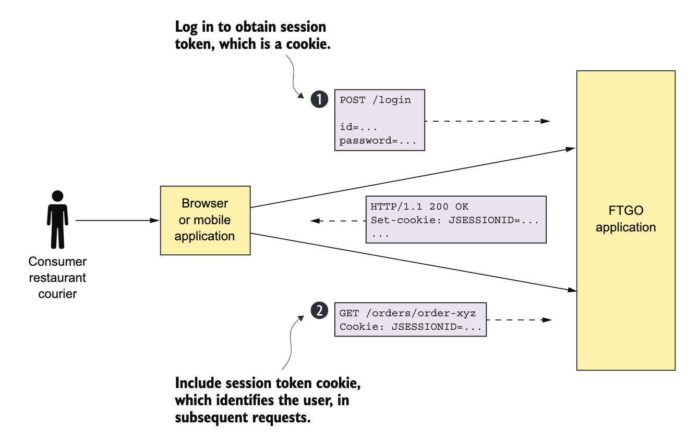
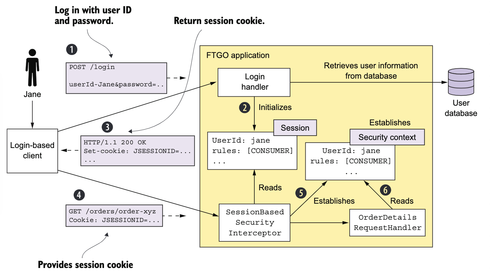
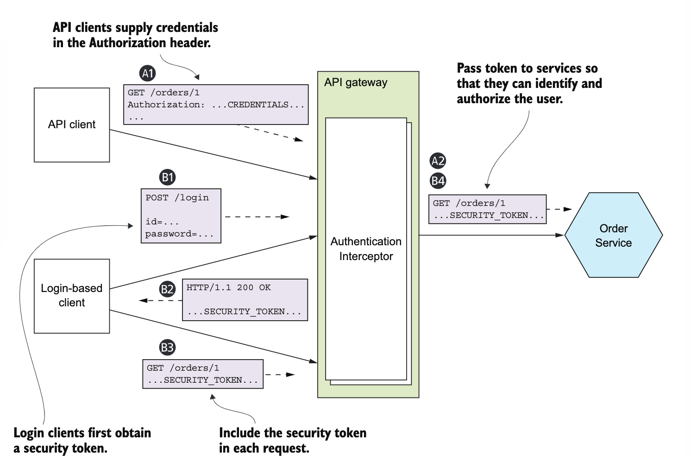
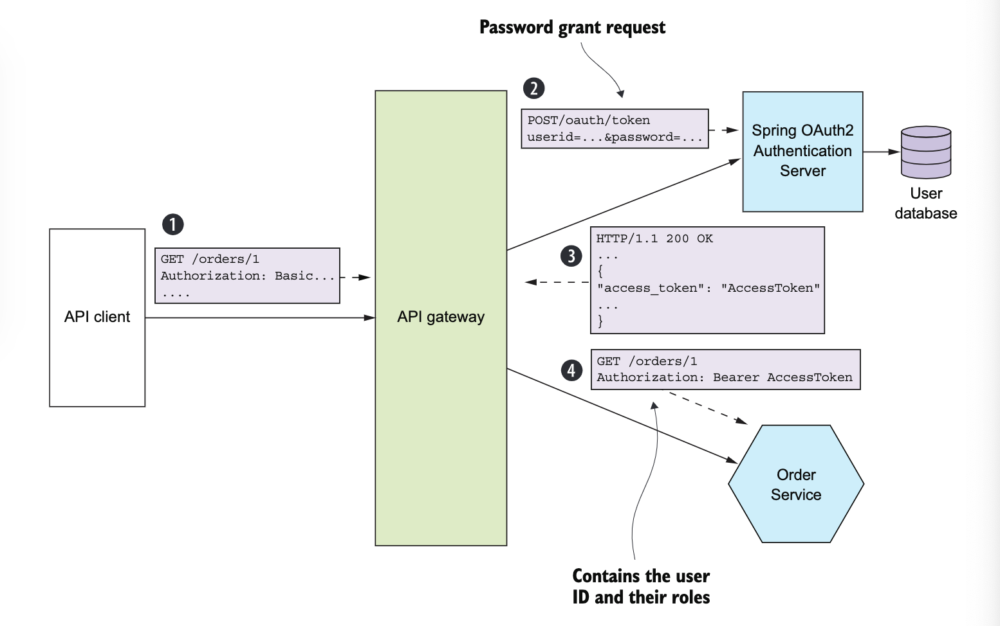
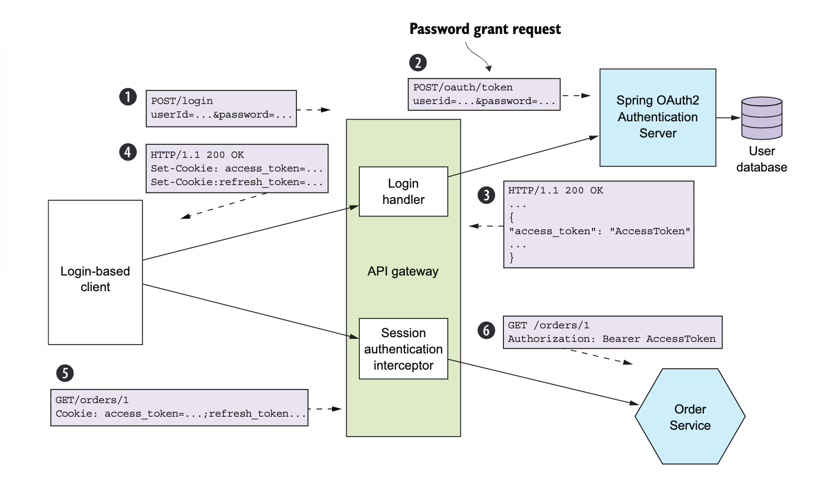

# Critères de qualité nécessaires avant la mise en production

- securité
- configurabilité
- observabilité

## Sécurité

Il faut un mécanisme pour passer l'identité d'un utilisateur d'un service à l'autre

## Aspects de la sécurité

- authentification

vérifier l'identité d'une application ou d'un humain (on appelle cette identité le _principal_)

- autorisation

vérifier que le principal a le droit d'effectuer l'opération demandée sur les données demandées

On utilise souvent une combinaison de rôles et d'ACL (_Access Control List_)

Les rôles permettent d'attribuer des permissions à des rôles pour invoquer certaines opérations

Les ACLs permettent aux utiliseurs ou aux roles d'effectuer des opérations sur certains objets business ou aggrégats

- audition

Suivi des opérations effectuées par un donneur d'ordre afin de détecter les problèmes de sécurité, d'aider le service clientèle et d'assurer la conformité

- communication interprocess

toutes les communications, entrantes ou sortantes des services, doivent se faire par TLS et ont même parfois besoin d'authentification

### Exemple monolithique

Authentification pour obtenir un token de session en cookie

La deuxième requête contient le token de session

Une clé d'une architecture de sécurité est la session, qui contient l'id du principal et ses rôles

D'habitude, c'est un token opaque, chiffré par cryptographie

Une autre clé est le contexte, qui contient les informations sur l'utilisateur qui effectue la requête

Dans cette app, ils utilisent l'autorisation basée sur le role: CONSUMER, RESTAURANt, COURIER et ADMIN

La gestion des rôles est entrelassé avec la logique métier, par exemple seul un consommateur peut accéder à ses commandes alors qu'un administrateur peut accéder à toutes les commandes

Il y d'autres façons de gérer la sécurité

Par exemple, avoir la session en mémoire oblige toutes les requêtes pour une session d'être redirigées dans la même instance de l'application, du coup on doit faire du load balancing plus compliqué

On doit aussi avoir un mécanisme de drainage de sessions qui attent que toutes les sessions expirent avant d'éteindre une instance de l'app

Une autre approche est d'avoir la session dans la base de données

Il est possible de se débarasser de la session côté serveur

Par exemple, on peut avoir une clé d'API et un secret à chaque requête

Ou avoir un token de session pour gérer l'état de la session

### Dans une archi microservices

C'est une architecture distribuée

Chaque requête est gérée par l'API gateway et au moins un service

Exemple pour l'app, `getOrderDetails`, l'API gateway va gérer cette requête en invoquant plusieurs servics, `Order Service`, `Kitchen Servier`, `Accounting Service`

Niveau sécu, `Order Service` n'autorise qu'un seul utilisateur à voir ses commandes, on a donc besoin d'authentification et d'autorisation

Différences par rapport à un monolithe:

- Pas de contexte en mémoire pour passer l'identité de l'utilisateur de service en service. Les services ne partagent pas de mémoire
- Pas de session centralisée, une session en mémoire ne marche pas. En théorie, plusieurs services pourraient accéder à la session en base de données, sauf que ça viole le concept de couplage lâche

1. Authentification

Plusieurs solutions:

- avoir un service qui gèrent l'authentification des utilisateurs

Permet des requêtes non-autorisées à rentrer dans le réseau interne

Ca signifie que chaque équipe de développement va devoir implémenter correctement la sécurité pour tous les services

Autre problème, on pourrait avoir des client qui s'authentifient de façons différentes

Un client API donne des credentials avec chaque requête en basic authentication, un autre aura un token de session à fournir à chaque requête

On veut pas que nos services aient à gérer plusieurs types de mécanismes d'authentification

Une meilleure approche est que l'API gateway authentifie les requêtes avant d'atteindre nos services

Il n'y a qu'un seul endroit pour obtenir les droits, ainsi moins de vulnérabilités possibles

De plus, seul l'API gateway a à gérer les mécanismes d'authentification

Les clients s'authentifient par l'API gateway

Les clients de l'API donnent leur credentials à chaque requête

Ceux qui utilisent leur credentials reçoivent un token de session

Un service invoqué par l'API gateway a besoin de savoir quel est le principal qui a fait la requête et que la requête a bien été authentifiée

La solution est l'API gateway inclue un token à chaque requête de service

Le service peut ensuite utiliser le token pour valider la requête et obtenir des informations sur le principal

L'API peut aussi fournir le même token aux clients avec une session à utiliser comme token de session

2. Autorisation

Vérifie que le client a le droit d'effectuer une requête

Par exemple, `getOrderDetails` ne peut être invoqué que par un consommateur qui a effectué la commande `Order` ou un agent du spport qui aide le client

On peut passer par l'API gateway, qui peut restreindre laccès à `GET /orders/{orderId}` seuls aux bons consommateurs et agents du support

Si un utilisateur n'a pas les droits, l'API gateway peut rejeter la requête avant de la transmettre au service

Mais ça veut dire coupler l'API gateway aux services (si un service est à mettre à jour, il faut aussi mettre à jour l'API gateway)

Ce n'est pas non plus pratique pour l'API gateway d'implémenter les ACL pour accéder aux objets domaine, parce que ça veut dire qu'il connait les détails de la logique domaine

Une autre façon de gérer les autorisations est dans un service

Un service peut implémenter un autorisation par rôle pour les URLs et les méthodes de service

Il faut aussi gérer les ACL pour gérer les accès aux aggrégats

`Order Service` implémente les autorisation des rôles et ACLs pour contrôller l'accès aux commandes

3. Utiliser les JWT pour passer l'identité et les roles

Il y a deux types de tokens

- opaque token, qui sont généralement des UUIDs

Comme les services doivent faire un appel synchrone RPC à un service de sécurité pour valider le token, ils réduisent les performances, la disponibilité et augmentent la latence

- token transparent qui contient les informations sur l'utilisateur

Un standard populaire est le JWT

C'est un moyen standard et sécurité pour représenter les claims (revendications), comme l'identité des utilisateurs et les rôles

Un JWT a un payload JSON qui contient des infos sur l'utilisateur, comme son identité et ses rôles, et autre méta données, comme une date d'expiration

Il est signé par un secret que seul le créateur du JWT, comme l'API gateway par exemple et le réceveur du JWT, comme un service

Un problème des JWT est que comme un token est self-contained (il contient toutes les informations dont il a besoin), il ne peut pas être révoqué

Un service va effectuer une son opération après avoir vérifié la signature d'un JWT et sa date d'expiration

On ne peut donc pas révoqué un token JWT individuel s'il est tombé dans des mains mal intentionnées

La solution est d'émettre des JWT de durée courte, pour limiter ce que pourrait faire un attaquant

L'inconvénient est que l'application doit réémettre des token continuellement pour garder la session active, ce qui est réglé par OAuth 2.0

4. OAuth 2.0

Imaginon qu'on veut implémenter un `User Service` qui gère la base de données utilisateurs qui a les informations sur les utilisteurs, tels que les identifiants et les rôles

L'API Gateway appelle le `User Service` pour authentifer une requête client et obtenir un JWT

On pourrait concevoir une API de `User Service` et l'implémenter dans notre framework habituel, mais c'est une fonction générique pas spécifique à notre application

On peut à la place utiliser OAuth 2.0

Protocole d'autorisation conçu à l'origine pour les services clouds comme Github et Google, pour que des applications tierces obtiennent accès sans fournir de mot de passe

Concepts clés d'OAuth 2.0

- serveur d'autorisation

API pour authentifier les utilisateurs et obtenir un token d'accès et un token de refresh

- token d'accès

donne accès à un `Resource Server` dont le format est indépendant de l'implémentation

- refresh token

token à la vie longue mais révoquable qu'un client utilise pour obtenir un nouveau token d'accès

- server de ressources

utiliser un token d'accès pour autoriser un accès

en microservices, les services sont des serveurs de ressources

- client

un client veut un accès à un serveur de ressource

en microservices, l'API Gateway est le client OAuth 2.0

Comment authentifier les clients de l'API ?

Le serveur d'authentification valide les credentials et retourne un token d'accès et de refresh. Les services vont ensuite valider le token d'accès et l'utiliser pour autoriser les requêtes.

Un API gateway basé sur OAuth 2.0 peut authentifier les clients orientés sessions en utilisant le token d'accès OAuth 2.0 comme un token de session

Quand un token d'accès expire, il peut obtenir un nouveau token en utilisant un token de refresh

On passe par le API Gateway contrairement à ce que montre l'image

Les tokens d'accès et de refresh sont envoyés au client comme cookies par exemple

On a dans l'API Gateway un `Service Authentifcaiton Interceptor` qui valide le token d'accès et l'inclus dans ses requêtes vers les services

Si le token d'accès a expiré ou va bientôt expiré, l'API Gateway obtient le nouveau token d'accès en faisant une requête d'OAuth 2.0 REfresh GRant, qui contient le token de refresh, vers le server d'autorisation

Si le token de refresh n'a pas été expiré et n'a pas été revoqué, le serveur d'autorisation retourne un nouveau token d'accès

L'API Gateway passe le nouveau token d'accès aux services et le retourne au client

5. Les idées principales

- L'API Gateway est responsable de l'authentification des clients
- L'API Gateway et les services utilisent un token transparent, comme JWT, pour passer les informations sur le principal
- Un service utilise un token pour obtenir l'identité du principal et ses rôle

## Configurabilité

Un service utilisera probablement un ou plusieurs services externes (base de données ou un agent de message)

L'emplacement réseau et les accréditions de chaque service extérieur dépendent de l'environnement dans lequel le service s'exécute

On ne peut pas faire en sorte que les propriétés de configuration soient hard-codées dans le service

Il faut plutôt externalisé le mécanisme de configuration qui fournit un service pour configurer au runtime

## Observabilité

Monitoring et logging ne sont pas suffisants

Chaque requête est géré par le API gateway et au moins un service

Par exemple, et si on doit déterminer lequel de 6 services provoquent de la latence ?

Imaginez si les logs sont dispersés entre 6 services
