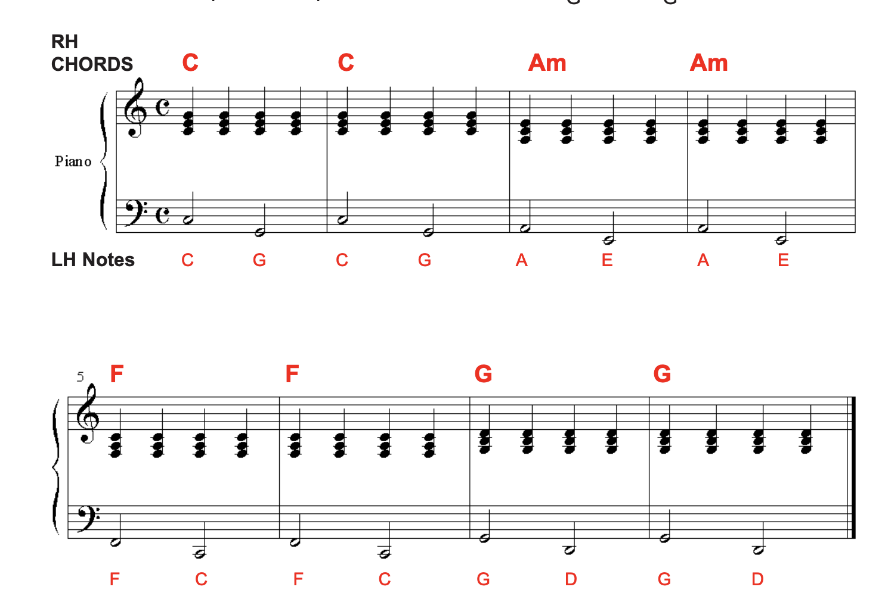
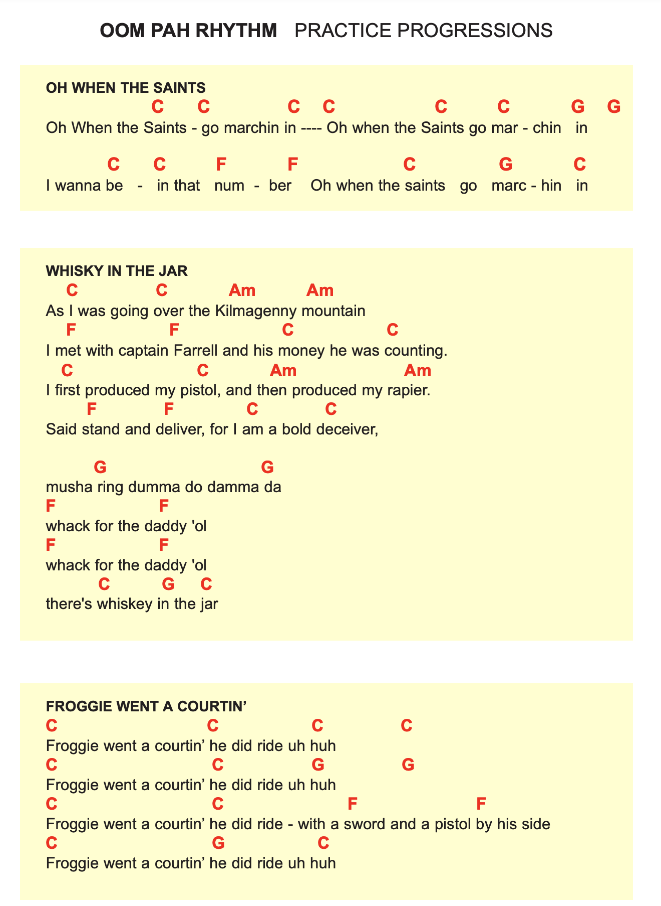
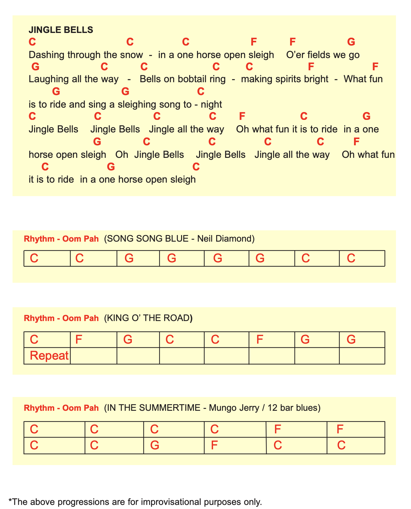

# Oom pah

Généralement produit par le tuba qui alterne entre la racine (tonique) de l'accord et la 5ème (dominante) - on dit que ce son est le oom

Le pah est joué sur les temps morts par des instruments plus aigus tels que la clarinette, l'accordéon ou le trombone

