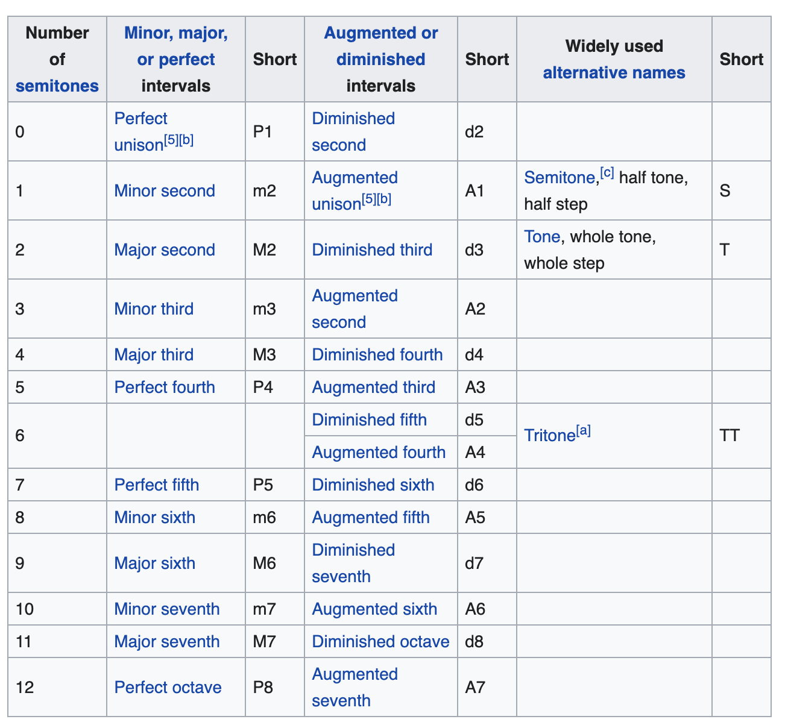
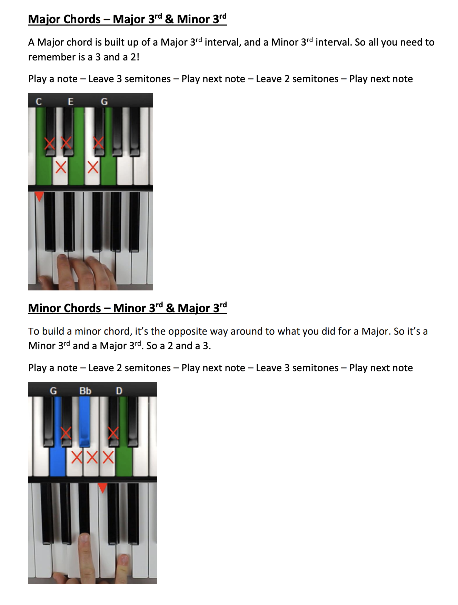

# Intervalle

Un intervalle est la différence de hauteur entre deux sons.

- intervalle horizontal (linéaire ou mélodique), sons qui se succèdent, comme deux hauteurs adjacentes dans une mélodie
- intervalle vertical (harmonique), sons simultanés, comme dans un accord

## Noms

## Comment construire un accord ?

