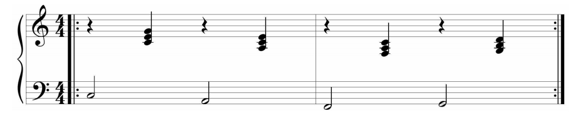

# Progression I-vi-IV-V ou '50s progression en anglais

Progression d'accords et turnaround populaire dans la musique occidentale

Représenté par la progression d'accord I-vi-IV-V

Très associé à doo-wop

## Variations

- faire une rotation de la dominante
- changer le V en V7
- répéter la progression I-vi suivi par une seule progression IV-V
- substituer le sous dominant IV par ii, donnant ainsi la progression ii-V-I
- inverser vi et IV
- I-V-vi-IV
- I-vi-iv-V

